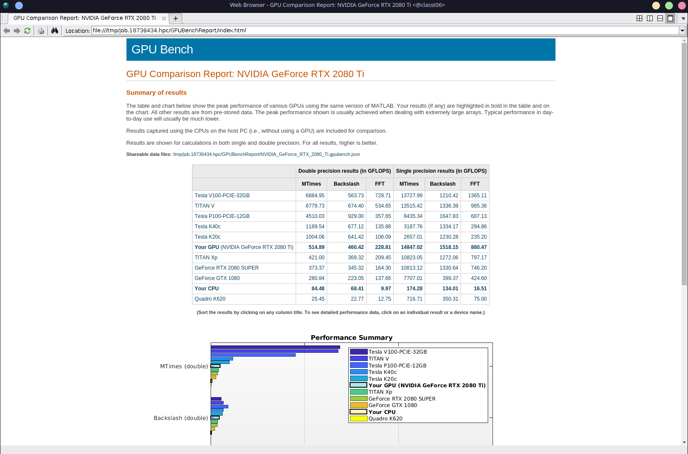

## Acknowledgements
### Additional Software Used:
1. [Hyperfine](https://github.com/sharkdp/hyperfine) for time comparison
2. [Asciinema](https://asciinema.org/) for terminal recording.
3. [AGG](https://github.com/asciinema/agg) for converting .cast files into .gif

## Part 1; SSE2 vs. AVX2

### Explanation of outcome:
I used Hyperfine to compare the two methods by running each method 10 times, and averaging the results.
AVX2 on average was 1.28 +/- .76 times faster than SSE2.
This is a very unstable range, meaning there could be extraneous conditions affecting the runtimes (other users/processes on the cluster), however I can't really control for this without sudo perms or a tool like [GameMode](https://github.com/FeralInteractive/gamemode) (requires sudo to install).

## Part 2; Matlab GPU Benchmark.

### GPU Benchmark Results:

### Explanation of outcome
The GPUBenchmark places our GPU (RTX 2080 Ti) after a Titan V and Before a 1080/2080 Super. This makes sense given the performance of these cards.
As for our CPU, the placement also makes sense, as the the benchmark relies on multithreaded calculations, the entire purpose of GPUs.
What is very interesting is that our GPU gets very close to the performance of the Titan V in Single Precision calculations. This could be related to the fact that the Titan V is targeted towards Data Science workloads, and the 2080Ti is targeted for realtime Computer Graphics rendering. (SP calculations may be more important for gaming workloads).
